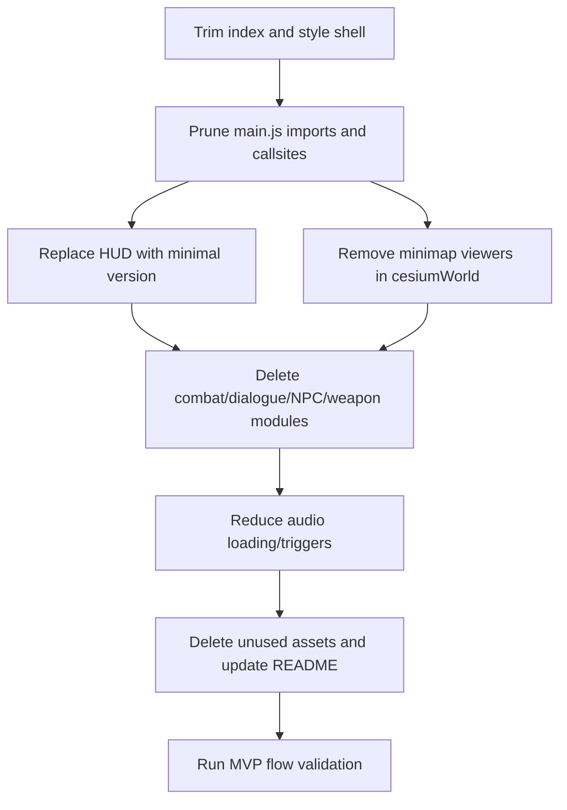

# Minimal Flight MVP Reduction Plan

## Target MVP Scope
- Keep only: one plane, core flight controls/physics, Cesium world map, spawn location selection, and a minimal HUD.
- Remove: combat systems, mission-like/tutorial dialogue, minimaps, credits/about pages, and most audio/UI complexity.

## Phase 1: Remove Out-of-Scope UI Surfaces
- Trim menu and modal markup in [C:/Users/japit/OneDrive/Desktop/web-flight-simulator/index.html](C:/Users/japit/OneDrive/Desktop/web-flight-simulator/index.html):
  - Remove `CREDITS` and `ABOUT DEVELOPER` buttons.
  - Remove `#creditsModal` and `#aboutBtnModal` blocks.
  - Remove `#dialogue-container` and `#game-credits`.
  - Remove in-flight and pause minimap blocks (`#minimap-container`, pause map wrappers/canvases).
  - Remove weapon/kill UI blocks (`#weapons-hud`, `#kill-notification-container`).
- Prune corresponding styles in [C:/Users/japit/OneDrive/Desktop/web-flight-simulator/src/style.css](C:/Users/japit/OneDrive/Desktop/web-flight-simulator/src/style.css) to avoid dead CSS and selector drift.

## Phase 2: Cut Systems Not Needed by MVP
- In [C:/Users/japit/OneDrive/Desktop/web-flight-simulator/src/main.js](C:/Users/japit/OneDrive/Desktop/web-flight-simulator/src/main.js), remove imports/usages for:
  - `WeaponSystem`, `NPCSystem`, `DialogueSystem`, `particles`, `JetFlame`, and `regions` reverse geocoding helpers.
- Remove state/update branches tied to combat and tutorial:
  - Weapon input, lock/kill logic, projectile updates.
  - NPC spawn/update and related score/kill UX.
  - Dialogue start/pause/resume/skip flows.
- Delete now-orphaned modules once main references are removed:
  - [C:/Users/japit/OneDrive/Desktop/web-flight-simulator/src/systems/weaponSystem.js](C:/Users/japit/OneDrive/Desktop/web-flight-simulator/src/systems/weaponSystem.js)
  - [C:/Users/japit/OneDrive/Desktop/web-flight-simulator/src/systems/npcSystem.js](C:/Users/japit/OneDrive/Desktop/web-flight-simulator/src/systems/npcSystem.js)
  - [C:/Users/japit/OneDrive/Desktop/web-flight-simulator/src/systems/dialogueSystem.js](C:/Users/japit/OneDrive/Desktop/web-flight-simulator/src/systems/dialogueSystem.js)
  - [C:/Users/japit/OneDrive/Desktop/web-flight-simulator/src/weapon/missile.js](C:/Users/japit/OneDrive/Desktop/web-flight-simulator/src/weapon/missile.js)
  - [C:/Users/japit/OneDrive/Desktop/web-flight-simulator/src/weapon/bullet.js](C:/Users/japit/OneDrive/Desktop/web-flight-simulator/src/weapon/bullet.js)
  - [C:/Users/japit/OneDrive/Desktop/web-flight-simulator/src/weapon/flare.js](C:/Users/japit/OneDrive/Desktop/web-flight-simulator/src/weapon/flare.js)

## Phase 3: Simplify Cesium + HUD to Minimal Runtime
- Refactor [C:/Users/japit/OneDrive/Desktop/web-flight-simulator/src/world/cesiumWorld.js](C:/Users/japit/OneDrive/Desktop/web-flight-simulator/src/world/cesiumWorld.js):
  - Keep only primary viewer (`viewer`).
  - Remove mini/pause viewers and related APIs (`setMinimapCamera`, `setPauseMinimapCamera`, `getMiniViewer`, `getPauseMiniViewer`).
- Replace current complex HUD implementation in [C:/Users/japit/OneDrive/Desktop/web-flight-simulator/src/ui/hud.js](C:/Users/japit/OneDrive/Desktop/web-flight-simulator/src/ui/hud.js) with MVP HUD responsibilities only:
  - Speed, altitude, coordinates, heading, and optional FPS.
  - Remove weapon HUD logic, kill notices, NPC markers, minimap rendering, and pause map rendering.
- Update `applySettings` and options modal in `main.js` + `index.html` to keep only meaningful MVP settings (e.g., graphics quality, antialiasing, optional sound toggle).

## Phase 4: Keep Spawn Selection, Remove Nonessential Spawn Extras
- Keep spawn selection as the sole pre-flight interaction in [C:/Users/japit/OneDrive/Desktop/web-flight-simulator/src/main.js](C:/Users/japit/OneDrive/Desktop/web-flight-simulator/src/main.js):
  - Map click to place spawn marker and confirm.
  - Optional: retain text search if desired; otherwise remove search UI and Nominatim calls for strict minimalism.
- Remove reverse-geocode labels and region notification dependencies from [C:/Users/japit/OneDrive/Desktop/web-flight-simulator/src/world/regions.js](C:/Users/japit/OneDrive/Desktop/web-flight-simulator/src/world/regions.js) if no longer needed.

## Phase 5: Reduce Audio to Minimal Set
- In `main.js` `initSounds`, keep only core sounds needed for MVP feel (recommended: `jet-engine`, `spawn`, optionally `boost`, `zoom-in`).
- Remove hooks for UI hover/click and combat/tutorial audio triggers.
- Keep `soundManager` only if minimal audio remains; otherwise remove audio system entirely and strip related settings/UI toggle.

## Phase 6: Asset and Documentation Cleanup
- Remove unused image/audio assets after code/UI removal (developer portraits, dialogue/combat-only sounds).
- Ensure single plane model reference is canonical (one model path, no alternate plane logic).
- Update [C:/Users/japit/OneDrive/Desktop/web-flight-simulator/README.md](C:/Users/japit/OneDrive/Desktop/web-flight-simulator/README.md) to reflect MVP feature set and controls.

## Safety/Validation Pass
- Run app and verify only this path works end-to-end:
  - Menu -> spawn selection -> confirm spawn -> flight -> pause/resume -> quit/restart.
- Validate no console errors from removed DOM IDs or removed module imports.
- Run lint/diagnostics for touched files and remove dead imports/code paths.

## Dependency-aware execution order

